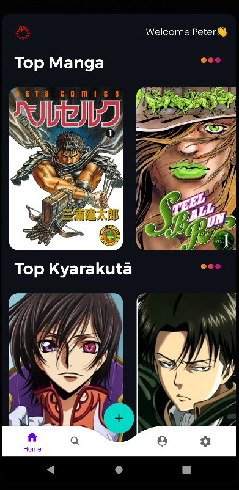

# OtakuVortex

> [!NOTE]
> Still on Work.

🌟Introducing **OtakuVortex**: Your Ultimate Hub for Anime and Manga Delights.Premier hub for anime and manga lovers🌸. Curated content, user-friendly interface, vibrant community. Dive into limitless anime and manga enjoyment.

<p align="center">
	
</p>

### Architecture

```
Android Clean Architecture integrates MVVM design pattern, structuring apps into UI, ViewModel, UseCase, and data layers. This separation boosts maintainability, testability, and scalability by enforcing modularization and dependency inversion, enabling easier updates, efficient testing, and adaptable changes across layers.
```

<p align="center">
	
</p>

### Screenshots 

<table>

<tr>
<td>
<p align="center">
	
</p>
</td>
<td>
<p align="center">
	
</p>
</td>
</tr>
</table>

### Library Used

- [LiveData](https://developer.android.com/reference/kotlin/androidx/lifecycle/LiveData)

- [Retrofit 2](https://github.com/square/retrofit)

- [Co-routines](https://github.com/Kotlin/kotlinx.coroutines)

- [Navigation](https://developer.android.com/jetpack/androidx/releases/navigation)

- [Paging 2](https://developer.android.com/topic/libraries/architecture/paging/)

- [Dagger Hilt](https://developer.android.com/training/dependency-injection/hilt-android)

- [Glide](https://github.com/bumptech/glide)

- [OkHttp Interceptor](https://github.com/square/okhttp/tree/master/okhttp-logging-interceptor)
